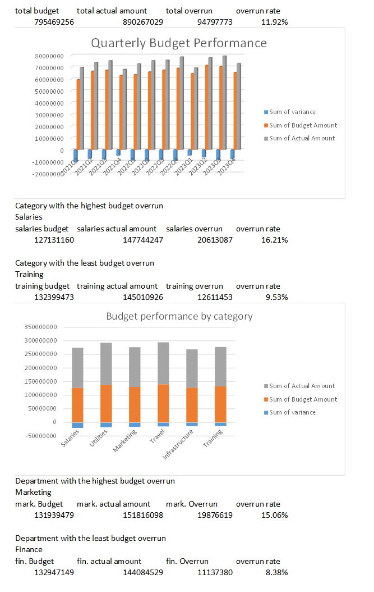
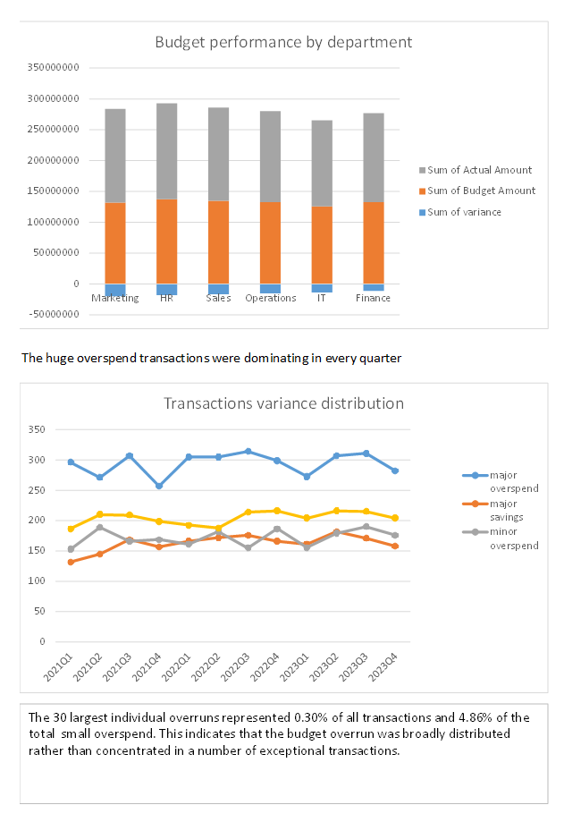

# budget-overrun-analysis

A small Excel portfolio project analyzing budgeted and actual expenditure across departments, categories and quarters.

## Dashboard

## What I Used

- data validation and cleaning
- Excel Tables and structured references
- formulas including IF, COUNTIF and COUNTBLANK
- PivotTables and PivotCharts
- financial variance analysis
- Excel dashboard design

## Key Findings

- Actual expenditure exceeded the total budget by 95.1 million, or 11.94%.
- Salaries had the highest category-level budget overrun.
- Marketing had the highest department-level budget overrun.
- The 30 largest overruns represented only 4.86% of total overspend, suggesting that the problem was broadly distributed.

## Files

- Budget overrun analysis.xlsx
- Budget overrun analysis - dashboard.pdf

## Data

The project uses a synthetic dataset containing approximately 10,000 financial transactions from 2021–2023.

Dataset source: https://www.kaggle.com/datasets/kennathalexanderroy/budget-vs-actual-financial-dataset
